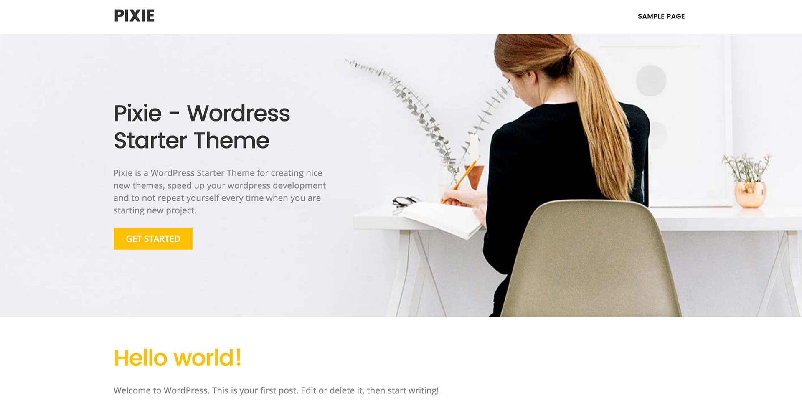
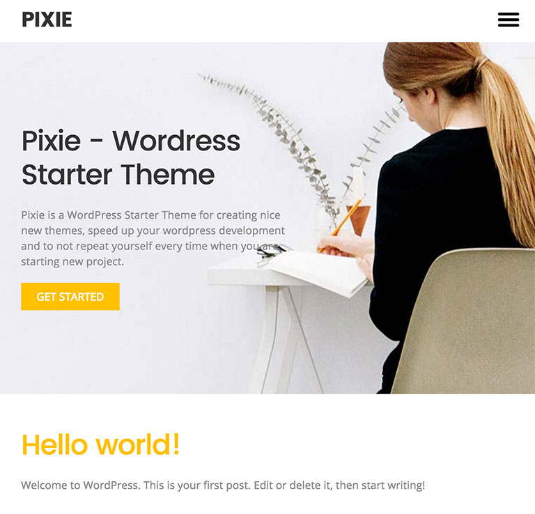
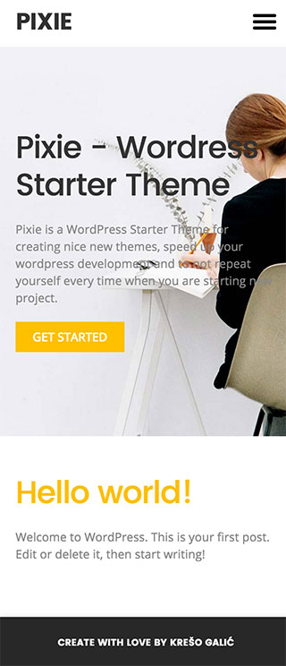

# Pixie - Wordpress Starter Theme

Pixie is a WordPress Starter Theme for creating nice new themes, speed up your wordpress development and to not repeat yourself every time when you are starting new project. Pixie uses [Bourbon](http://bourbon.io/) and [Neat](http://neat.bourbon.io/). Bourbon is simple and lightweight mixin library for Sass. Neat is A lightweight semantic grid framework.

With those two combinations you have all what you need to create awesome theme for your client. 

Version: 1.0

## Desktop version


## Tablet version

 
## Mobile version


## Usage

### 1. Clone repository

Clone repository to your folder in wp-content/themes.

```
https://github.com/kresogalic8/emerald.git
```

### 2. Rename folder name (optional)

After cloning repository, rename folder name however you want - for example "emerald". After renaming you need to change gulpfile.js with your new theme name. Here is the line where you need to change theme name: 

```
proxy   : "http://localhost/emerald/"
```

### 3. Install Gulp dependencies

Finally, you need to install all dependencies for Gulp, so gulp can run all tasks we have. Go to your theme folder in command line and run: 

```
npm install
```

### 4. Running Gulp

And here comes the magic part. Run gulp and all tasks are running. 

```
gulp
```

### Features

1. Easy to use
2. Responsive layout
3. Modular SCSS structure
4. Mixin library Bourbon
5. Flexible grid with Neat
6. Gulp for processing all SASS, JavaScript and images, and cross-device refreshing with BrowserSync

### Contributing:

Much more is coming. Anyone and everyone is welcome to contribute!